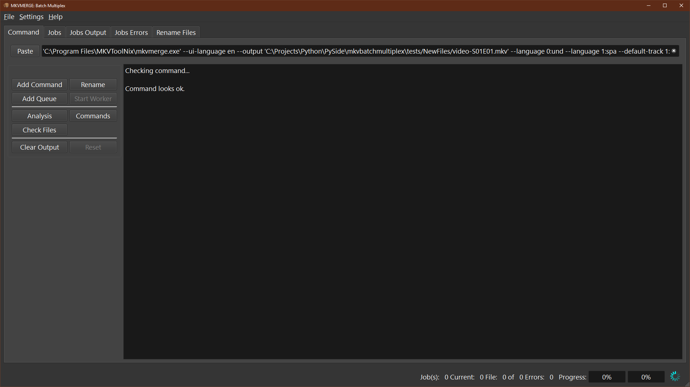

***************
Getting Started
***************

Using **MKVToolNix** do any desired operations on the first media file in the
source directory. When done copy the resulting command line to the clipboard:

    *Multiplexer->Show command line*

.. figure:: images/MKVToolNix-copytoclipboard.png
    :align: center

    Copy to clipboard

Open mkvbatchmultiplex and paste command using the **<Paste clipboard>**
button:

    Copy from clipboard

Now there are two options if there is only one source directory to work with
press **<Process>** button.  To work with more than one source directory
press **<Add Job>**.   **<Process>** intended to start working immediately on
the job at a time.  Even though the jobs generally are very time consuming
there is a very simple job queue system working **<Add Job>** adds to the
queue when done press **<Process Jobs>**
