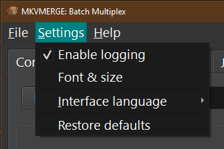

***********************
Using mkvbatchmultiplex
***********************

The application has a very simple interface:

.. figure:: images/mkvbatchmultiplex.png
  :align: center

  mkvbatchmultiplex

Requirements
============

In order for mkvbatchmultiplex to work as intended there are certain
conditions in the structure of the files in the source directories.
This has to be this way because we are working with group of files
not one file.  Also is a batch process there should not be any user
input requested when working of a job.

Structure for directories:

    * The media files in the directory have to be of the same type.
      The program will read the directory taking information form the
      template so it will apply instruction to the same type of file.

    * The files have to be consistent that is the same number of tracks
      of the same type and order.  Files found different from template
      will not be processed.

    * If more than one file are involved in the operation there have to
      be one of each for the resulting tracks.
      For example:

        The instruction if for a video file and a subtitle file to be
        multiplexed and there are 13 video files then there have to be
        13 subtitle files.

          One source directory:

          ==================  ==================
          /source1            /Destination
          ==================  ==================
          video - S01E01.avi  video - S01E01.mkv
          video - S01E01.srt
          video - S01E02.avi  video - S01E02.mkv
          video - S01E02.srt
          ...                 ...
          ...                 ...
          video - S01E13.avi  video - S01E13.mkv
          video - S01E13.srt
          ==================  ==================

    * For attachments the same files will be use for every operation.  If the
      attachments are per file the files have to be on a directory with
      one directory per file.  If a file does not have attachments the directory
      still has to exists but empty.

      - If more than one directory is used to get the attachments then the same
        attachments will be use for all the files.  The directory per file will
        not be check or used.

    * Files of the same type in the command have to be in different
      directories.  To process the files names are not used to pair
      the sources in alphabetical position is:

        Source1 AVI container source2 lang1.srt source3 lan2.srt:

          Two source directory:

          ==================  ==================  ==================
          /directory1         /directory2         /destination
          ==================  ==================  ==================
          video - S01E01.avi  video - S01E01.srt  video - S01E01.mkv
          video - S01E02.avi  video - S01E02.srt  video - S01E02.mkv
          ...                 ...                 ...
          video - S01E13.avi  video - S01E13.srt  video - S01E13.mkv
          ==================  ==================  ==================

      This the best option for the working directories.

Functionality
=============

Source File Naming
~~~~~~~~~~~~~~~~~~

The source and destination directories are taken from the template.
The resulting name in the directory is taken from the first media file
selected for the multiplexing.  The name for the subsequent files is
not used what is use is the order read.  The program will pair the files
by order found in the directory:

  ==================  ==================  ==================
  /directory1         /directory2         /destination
  ==================  ==================  ==================
  video - S01E01.avi  sub01.srt           video - S01E01.mkv
  video - S01E02.avi  sub02.srt           video - S01E02.mkv
  ...                 ...                 ...
  video - S01E13.avi  sub03.srt           video - S01E13.mkv
  ==================  ==================  ==================

If the destination directory already have a file with the destination
name a prefix **new-** will be used.  The job operation is not destructive
no file will be overwritten.

Settings
~~~~~~~~

  Settings.

The available settings:

  - Enable logging.  If enable logging is set the log will be saved on:

    - ~/.mkvbatchmultiplex/mkvBatchMultiplex.log

    with a rotation of 10 log files.

  - Font & Size. Change the font use by the interface.

  - Interface Language.  Change the language use by the interface.  English and
    Spanish are available.

  - Restore Defaults.  Restore default settings.

Tabs
~~~~

* **Command**

  This is the main tab where the command is registered

  .. figure:: images/mkvbatchmultiplex-tabcommand.png
    :align: center

    Command tab.

  **Command Tab buttons:**

  .. figure:: images/mkvbatchmultiplex-commandbuttons.png
    :align: center

    Command.

  - Paste

    Paste command line from system Clipboard is expected to be from
    a copy to clipboard from MKVToolnix.
  - Add Command

    Add the command to the jobs table with a **Waiting** status
  - Rename

    Go to the **Rename** tab
  - Add Queue

    Add command to the jobs table and the work Queue.   If the job worker is
    running the job will be processed
  - Start Worker

    Start working on the jobs in the queue.  While the jobs are being process
    more can be added to the queue.

  The following buttons are for troubleshooting:

  - Analysis

    Shows some information the command line parsing this can help
    solving problems as to why the command is not been accepted
  - Commands

    Show commands to be executed as lists to be submitted to a subprocess
  - Check Files

    Verify the files to be worked on and signals any command that don't
    pass consistency test.  Flagged commands will not be processed.
  - Clear Output

    Clear the output of the command window
  - Reset

    Clear contents of all output windows

* **Jobs**

  Displays a table with the jobs added for current session.

  .. figure:: images/mkvbatchmultiplex-tabjobs.png
    :align: center

    Jobs.

  Jobs **Status** column.  The jobs can be manipulated using this column:

    - **Waiting**: the job has to be added to the queue for processing.
      While the job is waiting double click it can be changed to **Skip**,
      meaning don't process the job.  Or using the push button
      **<Queue Waiting Jobs>** it will add the job to the job
      queue.
    - **Running**: this is the current running job.
    - **Done**: job already processed.
    - **Skip**: job will not be processed.
      While in Skip status the job can be changed back to previous status of
      **Waiting** or **Queue** if the worker is active
      it will be processed automatically.
    - **Aborted**: the job was stopped while it was running.
    - **Error**: and error ocurred while running.  A full destination disk can
      cause this.

  Jobs tab buttons:

    .. figure:: images/mkvbatchmultiplex-tabjobsbuttons.png
      :align: center

      Jobs buttons.

    - Queue Waiting Jobs

      Put all **Waiting** jobs on the Queue for processing
    - Clear Queue

      Set all jobs in the Queue to a Waiting status.  The Worker will not
      process them.
    - Star Worker

      Start the Worker and process all jobs on the Queue.
    - Abort Current Jobs

      Abort the current job immediately only the current file been processed
      will be deleted.  All finished files will not.
    - Abort Jobs

      Abort running jobs and all jobs on the Queue.

* **Jobs Output**

  Displays output messages generated by the running jobs.

  .. code-block:: bash

    mkvmerge v30.0.0 ('Interstellar') 64-bit
    '\video'S01E05.avi': Using the demultiplexer for the format 'AVI'.
    '\Video'S01E05.ass': Using the demultiplexer for the format 'SSA/ASS subtitles'.
    '\video'S01E05.avi' track 0: Using the output module for the format 'MPEG-4'.
    '\video'S01E05.avi' track 1: Using the output module for the format 'MP3'.
    '\Video'S01E05.ass' track 0: Using the output module for the format 'text subtitles'.
    The file 'C:\tests\NewFiles\new-video'S01E05 (15).mkv' has been opened for writing.
    Progress: 100%

    The cue entries (the index) are being written...
    Multiplexing took 0 seconds.

* **Jobs Errors**

  Display any errors found generally this means
  any files with inconsistent with original files
  track order or type don't match.

  .. code-block:: bash

    Error Job ID: 286 ---------------------

    Destination File: C:\tests\NewFiles\video - S01E04.mkv

    Error: In structure

    Source:
    File Nme: C:\tests\VideoFiles\video - S01E04.avi
    File Format: -AVI-

    Track: 1
    Order: 0 - Video
    Codec: None
    Language: None
    Format: MPEG-4 Visual

    Base Source:
    File Nme: C:\tests\VideoFiles\video-S01E01.avi
    File Format: -AVI-

    Track: 1
    Order: 0 - Video
    Codec: None
    Language: None
    Format: MPEG-4 Visual
    Track: 2
    Order: 1 - Audio
    Codec: None
    Language: None
    Format: MPEG Audio

    Number of tracks mismatched video - S01E04.avi: 1 - video-S01E01.avi: 2

    Error Job ID: 286 ---------------------

* **Rename Files**

  The Rename module uses python regular expressions witch is considered to be
  for advance users.  In order to help and make it as easy as possible regular
  expressions that cover a great number of the cases presented to me for
  downloaded series provided.  Also using '*' (asterisk) by itself as the
  regular expression a new name can be easily assigned.

  For the majority of media servers a good naming scheme for the episodes of
  a series is: ::

    Series Name - S01E01.mkv

  The part S01E01 represents season 1 episode 1.  If the files been process
  don't follow this scheme the system provides the ability to rename the
  output files. Using regular expressions you can rename the output file
  names.  Also if regular expressions are to difficult a new name with and
  index in the form: ::

    Series Name - S01E<i: NN>

  <i: NN> where NN is a number can be 0 padded. It will be substituted by a
  number starting with the value NN.

  .. figure:: images/mkvbatchmultiplex-renameindex.png
    :align: left

    Rename with incremental index.

  As shown in the figure to rename using and index set the regex to * (asterisk,
  and invalid regex to use).  Then enter the new name with the increment mark
  in the desired position.  Once satisfied push button Apply Rename

  Example:

  .. figure:: images/mkvbatchmultiplex-renameseriesepisode.png
    :align: left

    Rename with regex.

    Here is an example where the name contains the series name and the episode
    number only.

    The regular expression is: (\\[.*\\]\\W*|)(.*?)(\\W*-|)\\W*(\\d+).*

    The substitution string is: \\2 - S01E\\4

    For regular expressions the order is not important the episode number is
    taken from the name.  Also missing episodes won't affect the rename of the
    files.  What the regular expression is doing is creating 4 groups:

      1. (\\[.*\\]\\W*|) - this will match the group name if Analysis
      2. (.*?) - this will match the series name
      3. (\\W*-|) - this will match a '-' hyphen witch normally
         separates the name from the episode number
      4. (\\d+) - this will match the episode number

    In the substitution string \\N represent the group number \\2 for series name
    \\4 for episode number.  The other characters are literals.

  The operation can be undone with the **Undo** pushbutton before starting the
  execution of the batch operation.

  If it proves to difficult use the '*' with Series Name S01E<i: 01> for
  renaming.  Also I can help creating the regex by sending me the list of the
  original names and a template of the desired new name.

Know Issues
===========

Work on documentation.
