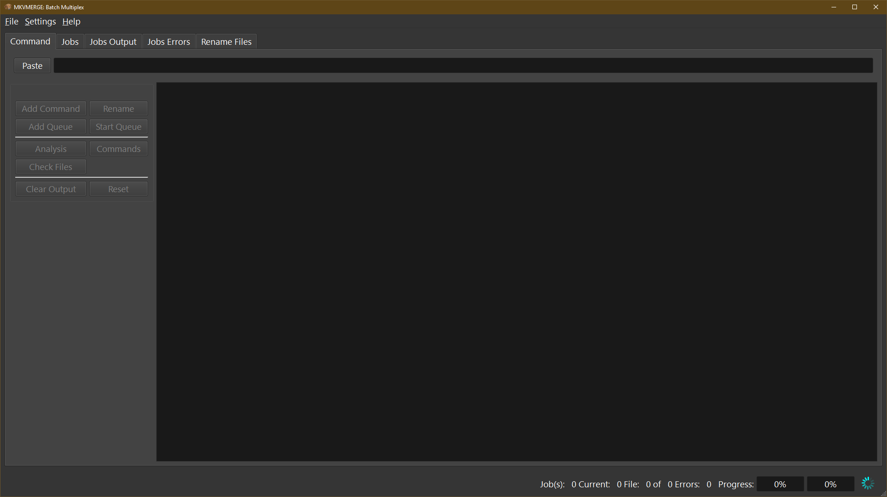

***********************
Using mkvbatchmultiplex
***********************

The application has a very simple interface:

  mkvbatchmultiplex

Requirements
============

In order for mkvbatchmultiplex to work as intended there are certain
conditions in the structure of the files in the source directories.
This has to be this way because we are working with group of files
not one files.  And is a batch process there should not be any user
input requested when working of a job.

Structure for directories:

    * The media files in the directory have to be of the same type.
      The program will read the directory taking information form the
      template so it will apply instruction to the same type of file.

    * The files have to be consistent that is the same number of tracks
      of the same type and order.  Files found different from template
      will not be processed.

    * If more than one file are involved in the operation there have to
      be one of each for the resulting tracks.
      For example:

        The instruction if for a video file and a subtitle file to be
        multiplexed and there are 13 video files then there have to be
        13 subtitle files.

          One source directory:

          ==================  ==================
          /source1            /Destination
          ==================  ==================
          video - S01E01.avi  video - S01E01.mkv
          video - S01E01.srt
          video - S01E02.avi  video - S01E02.mkv
          video - S01E02.srt
          ...                 ...
          video - S01E13.avi  video - S01E13.mkv
          video - S01E13.srt
          ==================  ==================

    * For attachments the same files will be use for every operation.

    * Files of the same type in the instruction have to be in different
      directories.  To process the files names are not used to pair
      the sources the position is:

        Source1 AVI container source2 lang1.srt source3 lan2.srt:

          Two source directory:

          ==================  ==================  ==================
          /directory1         /directory2         /destination
          ==================  ==================  ==================
          video - S01E01.avi  video - S01E01.srt  video - S01E01.mkv
          video - S01E02.avi  video - S01E02.srt  video - S01E02.mkv
          ...                 ...                 ...
          video - S01E13.avi  video - S01E13.srt  video - S01E13.mkv
          ==================  ==================  ==================

      This the best option for the working directories.

Functionality
=============

Source File Naming
~~~~~~~~~~~~~~~~~~

The source and destination directories are taken from the template.
The resulting name in the directory is taken from the first media file
selected for the multiplexing.  The name for the subsequent files is
not used what is use is the order read.  The program will pair the files
by order found in the directory:

  ==================  ==================  ==================
  /directory1         /directory2         /destination
  ==================  ==================  ==================
  video - S01E01.avi  sub01.srt           video - S01E01.mkv
  video - S01E02.avi  sub02.srt           video - S01E02.mkv
  ...                 ...                 ...
  video - S01E13.avi  sub03.srt           video - S01E13.mkv
  ==================  ==================  ==================

If the destination directory already have a file with the destination
name a prefix **new-** will be used.  The job operation is not destructive
no file will be overwritten.

Settings
~~~~~~~~

The only setting is to enable logging.  The log will be saved one
~/.mkvbatchmultiplex/mkvBatchMultiplex.log with a rotation of
10 log files.

.. figure:: images/mkvbatchmultiplex-logging.png
  :align: center

  Enable logging.

Buttons
~~~~~~~

.. figure:: images/mkvbatchmultiplex-mainbuttons.png

* Paste Clipboard

  Paste command line from system Clipboard is expected to be from
  a copy to clipboard from MKVToolnix.

* Process

  Start working on the command line.  The output of the job can be subsequent
  on the **Job Output** tab.

* Add Job

  If there is more than one operation to be done **Add Job** will add the
  command to a job queue

* Process Jobs

  Start working on the job queue.  While the jobs are running more jobs can be
  added to the queue.

* Clear Output

  Clear the output of the main window

* Clear/Reset

  Clear contents of all output windows and the job table.

The following buttons are for troubleshooting

* Analysis

  Shows some information on the parse of the command line this can help
  solving problems as to why the command is not been accepted

* Source Files

  Shows the source files to be worked with.

* Commands

  Show commands to be executed as lists to be submitted to a subprocess

* Check Files

  Verify the files to be worked on and signals any command that don't
  pass consistency test.  Flagged commands will not be processed.

Tabs
~~~~

* Job(s)

  Displays a table with jobs added for current session.
  Jobs **Status** column:

    - **Waiting** are in queue for processing.
      While the job is waiting with right click
      it can be changed to **Skip**
    - **Running** is the current running job.
    - **Done** job already processed.
    - **Skip** job will not be processed.
      While in Skip status the job can be changed
      to Waiting if the working thread is running
      it will be processed automatically.  If not
      it can be started with **Process Jobs** buttons

* Job(s) Output

  Displays output messages generated by the running jobs.

  .. code-block:: bash

    mkvmerge v30.0.0 ('Interstellar') 64-bit
    'C:\tests\VideoFiles\video'S01E05.avi': Using the demultiplexer for the format 'AVI'.
    'C:\tests\VideoFiles\Video'S01E05.ass': Using the demultiplexer for the format 'SSA/ASS subtitles'.
    'C:\tests\VideoFiles\video'S01E05.avi' track 0: Using the output module for the format 'MPEG-4'.
    'C:\tests\VideoFiles\video'S01E05.avi' track 1: Using the output module for the format 'MP3'.
    'C:\tests\VideoFiles\Video'S01E05.ass' track 0: Using the output module for the format 'text subtitles'.
    The file 'C:\tests\NewFiles\new-video'S01E05 (15).mkv' has been opened for writing.
    Progress: 100%

    The cue entries (the index) are being written...
    Multiplexing took 0 seconds.

* Job(s) Error(s)

  Display any errors found generally this means
  any files with inconsistent with original files
  track order or type don't match.

  .. code-block:: bash

    Error: In structure
    File Nme: C:\tests\VideoFiles\video - S01E04.avi
    File Format: -AVI-

    Track: 1
    Order: 0 - Video
    Codec: None
    Language: None
    Format: MPEG-4 Visual

    File Nme: C:\tests\VideoFiles\video-S01E01.avi
    File Format: -AVI-

    Track: 1
    Order: 0 - Video
    Codec: None
    Language: None
    Format: MPEG-4 Visual
    Track: 2
    Order: 1 - Audio
    Codec: None
    Language: None
    Format: MPEG Audio

Know Issues
===========
