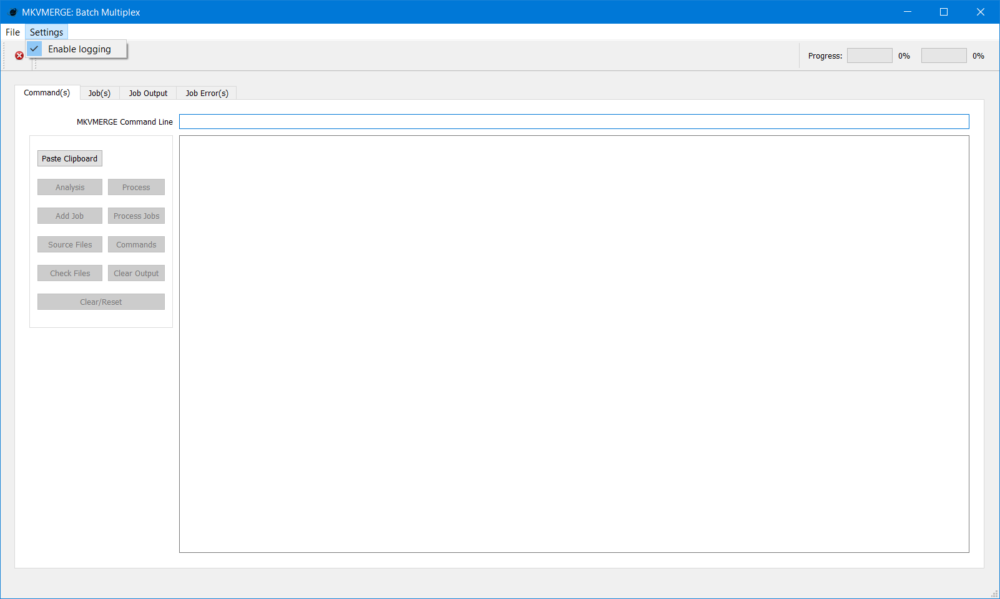

***********************
Using mkvbatchmultiplex
***********************

The application has a very simple interface:

.. figure:: images/mkvbatchmultiplex.png
  :align: center

  mkvbatchmultiplex

Requirements
============

In order for mkvbatchmultiplex to work as intended there are certain
conditions in the structure of the files in the source directories.
This has to be this way because we are working with group of files
not one files.  And is a batch process there should not be any user
input requested when working of a job.

Structure for directories:

    * The media files in the directory have to be of the same type.
      The program will read the directory taking information form the
      template so it will apply instruction to the same type of file.

    * The files have to be consistent that is the same number of tracks
      of the same type and order.  Files found different from template
      will not be processed.

    * If more than one file are involved in the operation there have to
      be one of each for the resulting tracks.
      For example:

        The instruction if for a video file and a subtitle file to be
        multiplexed and there are 13 video files then there have to be
        13 subtitle files.

          One source directory:

          ==================  ==================
          /source1            /Destination
          ==================  ==================
          video - S01E01.avi  video - S01E01.mkv
          video - S01E01.srt
          video - S01E02.avi  video - S01E02.mkv
          video - S01E02.srt
          ...                 ...
          video - S01E13.avi  video - S01E13.mkv
          video - S01E13.srt
          ==================  ==================

    * For attachments the same files will be use for every operation.

    * Files of the same type in the instruction have to be in different
      directories.  To process the files names are not used to pair
      the sources the position is:

        Source1 AVI container source2 lang1.srt source3 lan2.srt:

          Two source directory:

          ==================  ==================  ==================
          /directory1         /directory2         /destination
          ==================  ==================  ==================
          video - S01E01.avi  video - S01E01.srt  video - S01E01.mkv
          video - S01E02.avi  video - S01E02.srt  video - S01E02.mkv
          ...                 ...                 ...
          video - S01E13.avi  video - S01E13.srt  video - S01E13.mkv
          ==================  ==================  ==================

      This the best option for the working directories.

Functionality
=============

Naming
~~~~~~

The source and destination directories are taken from the template.
The resulting name in the directory is taken from the first media file
selected for the multiplexing.  The name for the subsequent files is
not used what is use is the order read.  The program will pair the files
by order found in the directory:

  ==================  ==================  ==================
  /directory1         /directory2         /destination
  ==================  ==================  ==================
  video - S01E01.avi  sub01.srt           video - S01E01.mkv
  video - S01E02.avi  sub02.srt           video - S01E02.mkv
  ...                 ...                 ...
  video - S01E13.avi  sub03.srt           video - S01E13.mkv
  ==================  ==================  ==================

If the destination directory already have a file with the destination
name a prefix **new-** will be used.  The job operation is not destructive
no file will be overwritten.

Settings
~~~~~~~~

The only setting is to enable logging.  The log will be saved one
~/.mkvbatchmultiplex/mkvBatchMultiplex.log with a rotation of
10 log files.

  Enable logging.

Know Issues
^^^^^^^^^^^

When a job is running and exit is requested a prompt to stop the
job will appear and a signal will be sent to the execution thread
to stop.  When a message is shown that the job was aborted then
you could exit.  This will change to stop the job then exit if
the program waits for the threadpool to stop the GUI freezes.
The way it works now is the less problematic approach.
